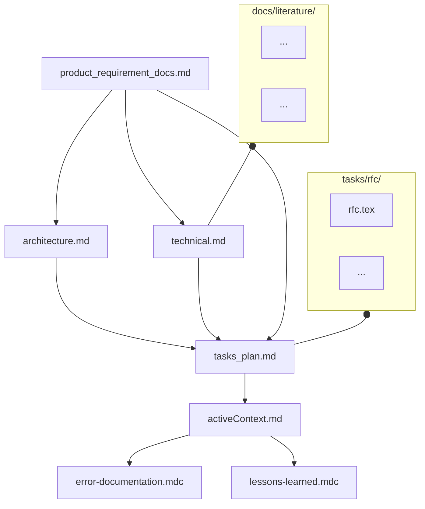
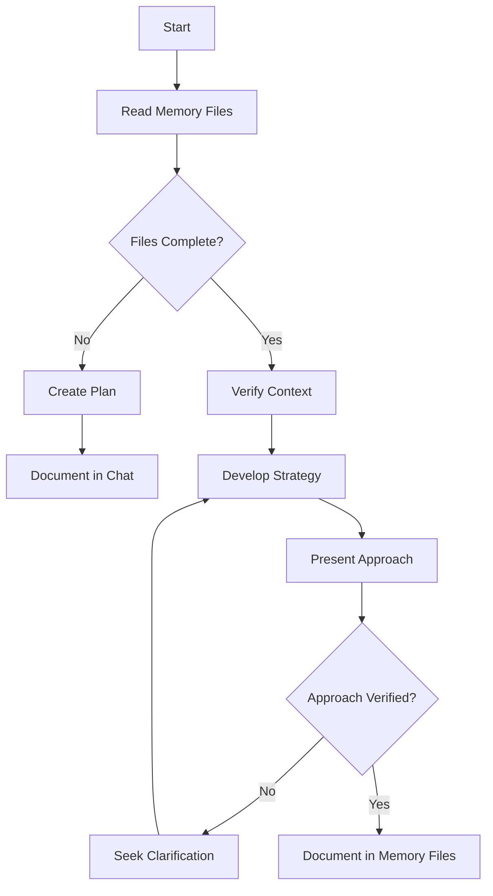
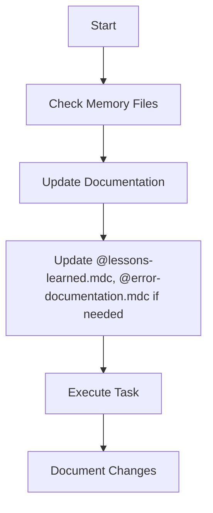
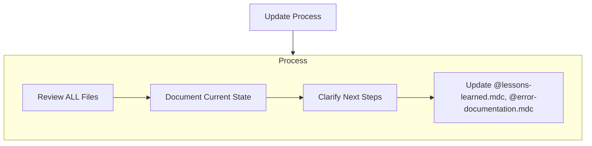
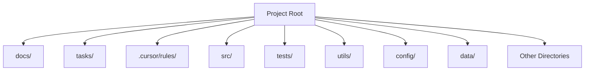

# Memory Bank Structure
The Memory Bank consists of required core files and optional context files. Files build upon each other in a clear hierarchy:

## Core Files (Required)
  7 files: 
  1. docs/product_requirement_docs.md @product_requirement_docs.md : Product Requirement Document (PRD) for the project or an SOP. 
  - Why this project exists
  - Problems it solves
  - Defines core requirements and goals
  - Foundation document that shapes all other files
  - Source of truth for project scope
  - Created at project start if it doesn't exist

  2. docs/architecture.md @architecture.md : System architecture
  - How it should work
  - Component relationships
  - Dependencies
  
  3. docs/technical.md @technical.md : Development environment and stack
  - Technologies used
  - Development setup
  - Key technical decisions
  - Design patterns in use
  - Technical constraints

  4. tasks/tasks_plan.md @tasks_plan.md : Detailed Task backlog
  - In-Depth Tasks list and Project Progress
  - What works
  - What's left to build
  - Current status
  - Known issues
  
  5. docs/active_context.md  @active_context.md : Current state of development
  - Current work focus
  - Active decisions and considerations
  - Recent changes
  - Next steps
  6. .cursor/rules/error-documentation.mdc @error-documentation.mdc : 
  - During your interaction, if you find a fix to a mistake in this project or a correction you received reusable, you should take note in the @error-documentation.mdc file so you will not make the same mistake again.
  - Known issues: their state, context, and resolution
  7. .cursor/rules/lessons-learned.mdc @lessons-learned.mdc : learning journal for each project
  - It captures important patterns, preferences, and project intelligence
  - It is detailed in @lessons-learned.mdc

## Context Files (Optional)
Detailed docs. Retrieve on demand if needed for context.

1. docs/literature/ :
  - literature survey and researches are in this directory  
  - Each literature topic is a latex file (docs/literature/*.tex)

2. tasks/rfc/ :
  - contains RFC for each individual task in @tasks_plan.md
  - RFCs will be in latex file format (tasks/*.tex)

## Additional Context
Create additional files/folders within memory-bank/ when they help organize:
- Integration specifications
- Testing strategies
- Benchmarking setups
- Possible Extensions
- Deployment procedures

# Core Workflows

## Plan Mode

## Act Mode

# Documentation Updates

Memory Files updates occur when:
1. Discovering new project patterns
2. After implementing significant changes
3. When user requests with **update memory files** (MUST review ALL files)
4. When context needs clarification
5. After Plan is verified 

Note: When triggered by **update memory bank**, I MUST review every memory bank file, even if some don't require updates. Focus particularly on tasks/active_context.md and tasks/tasks_plan.md as they track current state.

------------------------------------------------------------------------------------------------------------------------

---
description: rules to parse solution architecture from docs/architecture.md
globs: 
alwaysApply: false
---
# Architecture Understanding
READ_ARCHITECTURE: |
  File: docs/architecture.md @architecture.md
  Required parsing:
  1. Load and parse complete Mermaid diagram
  2. Extract and understand:
     - Module boundaries and relationships
     - Data flow patterns
     - System interfaces
     - Component dependencies
  3. Validate any changes against architectural constraints
  4. Ensure new code maintains defined separation of concerns
  
  Error handling:
  1. If file not found: STOP and notify user
  2. If diagram parse fails: REQUEST clarification
  3. If architectural violation detected: WARN user

------------------------------------------------------------------------------------------------------------------------

--------------
directory structure

---
description: the top-level directory structure for the project
globs: 
alwaysApply: false
---     
# Directory Structure

